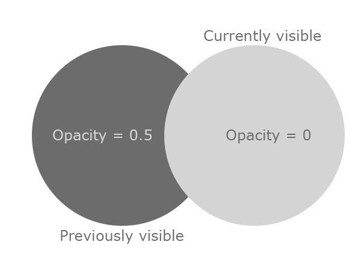

I worked on a Roguelike game from 8 March 2022 to 22 April 2022. My motivations were to teach myself new things, develop my existing skills, and have fun with the development process. Two out of three isn't bad. [Give it a try.](https://mochancrimthann.itch.io/45dr)

Starting a new project is always exciting, so I put in many hours in the first couple of weeks. There's no shortage of inspiring roguelike games, but most of my inspiration was directly from [DCSS](https://crawl.develz.org/). I completed procedural generation, movement, tile visibility, combat, items, enemy AI, and a character controller within the first week and a half. Most of the development was straightforward to reason. I decided early in development to create a new component for each feature to avoid breaking previous ones. Nothing drains my motivation like a week-long bug-fixing marathon.

My method of generating a dungeon level was disappointingly simple: [binary space partitioning](https://en.wikipedia.org/wiki/Binary_space_partitioning). BSP will determine whether a space can be split in half and then randomly split it vertically or horizontally. Repeat this until the space is sufficiently divided, determine how much of that space to use, then connect it to others with corridors. I separated the logic for generating the space of the dungeon and displaying the dungeon into two separate components: Dungeon Generator and Dungeon Renderer. The renderer is responsible for waiting for the generator to finish and then rendering the tiles onto a Unity tilemap.
 
The field of view (FOV) system is simple as well. This system uses another tilemap for rendering visibility. Each tile initializes to black with full opacity (`RGBA(0, 0, 0, 1)`). The opacity value will change to 0.5 or 0 depending on visibility.

When the target entity's FOV updates each turn, the visibility tilemap checks a target's FOV. I used a C# `HashSet` of coordinates to represent each entity's FOV. The visibility system monitors a target's FOV and sets each visible tile's opacity to 0. Previously visible tiles' opacities are then set to 0.5. Determining which tiles were previously visible is as simple as taking the difference between the last turn's visible tiles and this turn's visible tiles (Previous - Current).

Once the dungeon finishes generating, all "decorators" are notified and begin placing objects through the dungeon. Decorators include the player, enemies, stairs, and treasure chests. These components became a dumping ground for hacky code and workarounds, so I tried to ensure this code didn't influence any other systems.

Procedural item generation took far and away the most amount of time for a disproportionately small payoff. The base item is simple: it's just a list of attributes. Any system which interacts with items queries this list. Moving all the behavior out of the items and into relevant systems allows for more contextual behavior. The idea is that items were naive containers of data, not unlike an ECS entity, and different systems would handle items differently. I wish I had adopted more of an ECS approach with how effective the items were.

As an example of the item and attribute system, I'll use `DamageAttribute`. It extends a base attribute called `ItemAttribute` which has a few overridable properties: `Label`, `EditorDescription`, and `Description`. It also has a string value to accept a [dice notation](https://en.wikipedia.org/wiki/Dice_notation) value representing the damage. The string gets parsed into a custom `Dice` object. The combat system queries all relevant items from the attacker and defender (namely, the attacker's weapon(s) and the defender's armor(s)). It rolls the attacker's hit value versus the defender's armor class (AC) to determine whether the hit connects. If the hit connects, it rolls all damage dice (by querying every item's `DamageAttribute`). Once the damage is determined, it queries the defender's highest level `IDamageHandler` and tells it to apply the damage. `IDamageHandler` is an interface that allows multiple sources of defense to handle incoming damage in a layered way (for example, AC -> elemental resistances -> physical resistances -> health).

I may have overengineered it a bit given how small the game is, but working with items and their attributes was very easy and let me develop complex systems around them with very little friction. The biggest time-sink was getting Unity to cooperate with these objects. This approach *requires* custom editor scripts to use their maximum effectiveness. Writing editor scripts for a small game isn't exactly how I wanted to spend my time. I could have probably used [Unity's DOTS](https://unity.com/dots) framework, but I've struggled with that before and didn't want to try again. I've made and used ECS frameworks before, but Unity's strikes me as needlessly complicated.

The UI was rushed at times and required me to rewrite it a few times. Thankfully it was kept minimal, so most of the rewrites didn't take much longer than half an hour. I think I'll pick up a UI framework and use that in the future.

To my surprise, the most common question and feedback I received was about the "(worn)" tag that's affixed to equipped items. Many people thought it was related to a durability system which makes sense in retrospect -- you can't "wear" a sword. The reason for using "worn" rather than "equipped" was that I'd frequently seen it used in this context, and I wanted to maximize character space for item names. Thanks to everyone who caught this -- it is small but valuable feedback.

It's too early to say if I want to come back and work on this game. I learned a lot from this experience, and I'm glad I did it. I'm thinking of writing articles on exactly how I implemented certain aspects of the game, so let me know if this would be valuable to you.